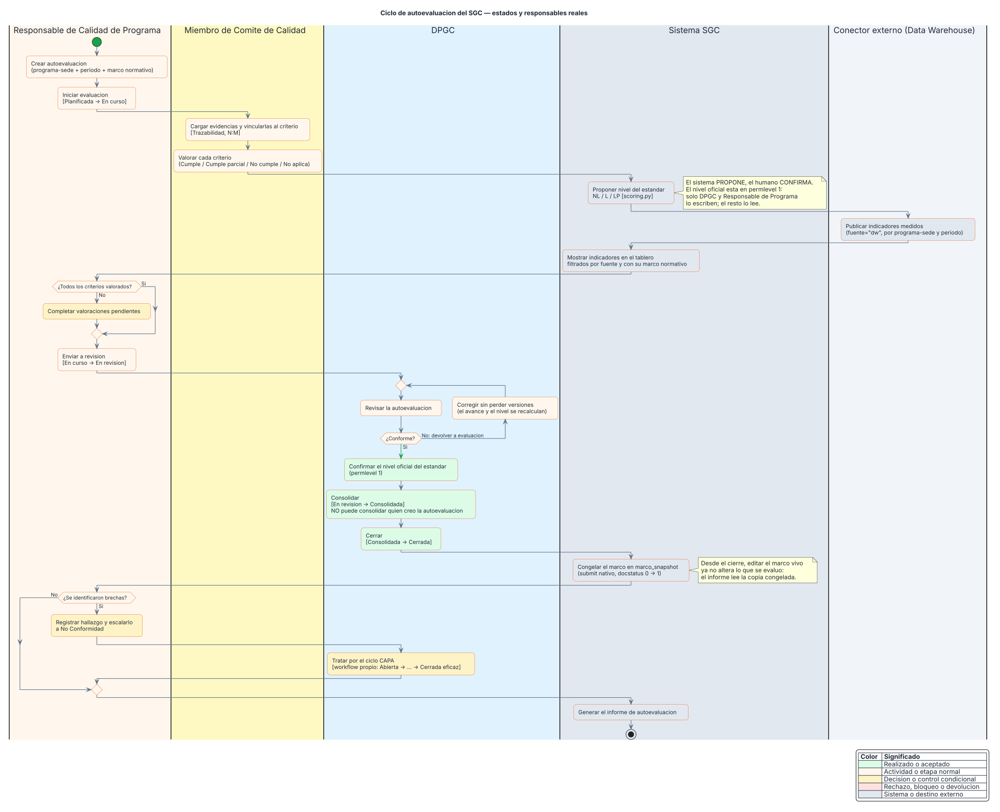

# Ciclo de autoevaluación — diagrama de actividad con carriles



Fuente editable: [`ciclo-autoevaluacion.puml`](ciclo-autoevaluacion.puml). El SVG se genera,
no se edita a mano.

## Qué muestra

El proceso central del SGC: cómo una autoevaluación pasa de creada a cerrada, quién ejecuta
cada paso y en qué momento entra el dato que viene de fuera.

**No es un diagrama aspiracional.** Los estados, las transiciones y los roles que aparecen son
los que están implementados: salen de `sgc/setup/f2_workflow.py`, y cualquier discrepancia
entre el diagrama y ese archivo es un error del diagrama.

## Los cinco carriles

| Carril | Qué hace |
|---|---|
| Responsable de Calidad de Programa | Conduce la autoevaluación de su programa: la crea, la inicia y la envía a revisión |
| Miembro de Comité de Calidad | Carga evidencias y valora criterios. No cierra ni aprueba |
| DPGC | Revisa, devuelve, confirma el nivel oficial, consolida y cierra |
| Sistema SGC | Propone niveles, muestra indicadores, congela el marco y genera el informe |
| Conector externo | Publica indicadores medidos por API; no es una persona |

## Tres cosas que el diagrama hace explícitas

**El sistema propone y el humano confirma.** El motor de scoring calcula un nivel sugerido para
cada estándar, pero el nivel oficial es un campo en permlevel 1: solo el Responsable de Programa
y la DPGC lo escriben. Quien mira el registro ve el nivel; no todos pueden fijarlo.

**Quien crea una autoevaluación no puede consolidarla ni cerrarla.** Las transiciones de
consolidación y cierre tienen la autoaprobación desactivada, así que exigen una segunda persona
con rol DPGC. Es segregación de funciones, no burocracia: consolidar es el acto que convierte el
trabajo del programa en el entregable de acreditación.

**El cierre congela el marco.** Al cerrar, la autoevaluación pasa por el submit nativo y guarda
una copia del árbol de estándares y criterios vigente en ese momento. A partir de ahí, editar el
marco normativo no altera lo que se evaluó: el informe lee la copia congelada. Sin eso, cambiar
un criterio en 2027 reescribiría el resultado de una acreditación de 2026.

## Lo que queda fuera a propósito

- **El ciclo CAPA** aparece como una sola caja. Tiene su propio workflow, con seis estados y su
  propia segregación (quien trata una no conformidad no la cierra). Merece su propio diagrama.
- **El acotamiento por ámbito.** El diagrama muestra quién hace qué, no sobre qué registros lo
  puede hacer. Eso está en [`../modelo-autorizacion.md`](../modelo-autorizacion.md).
- **Los otros ocho workflows** (documental, mejora, evidencia, auditoría, riesgos, encuestas,
  informe de cumplimiento, revisión por la dirección).

## Cómo regenerarlo

```bash
docker run --rm -v "$PWD:/data" -w /data plantuml/plantuml:latest -tsvg ciclo-autoevaluacion.puml
```

Comprobar que el render no trae un error dibujado dentro (PlantUML genera el SVG igualmente):

```bash
grep -c "Syntax Error" ciclo-autoevaluacion.svg   # debe dar 0
```

## Referencias al código

| Elemento del diagrama | Dónde vive |
|---|---|
| Estados y transiciones | `sgc/setup/f2_workflow.py` (`WF_AUTOEVAL`) |
| Nivel propuesto NL/L/LP | `sgc/scoring.py` |
| Nivel oficial en permlevel 1 | `sgc/setup/f3b_rbac.py` (`PERMLEVEL1`) |
| Congelado del marco | `Autoevaluacion.before_submit` y `scoring.construir_snapshot` |
| Evidencia ↔ criterio (N:M) | DocType `Trazabilidad` |
| Indicadores del conector externo | `sgc/indicadores_acreditacion.py` |
| Ciclo CAPA | `sgc/setup/f2_workflow.py` (`WF_NC`) y `sgc/capa.py` |
